# End-to-End CI/CD Workflow for a Java To-Do Application Using Jenkins and Kubernetes

This project demonstrates a Continuous Integration and Continuous Deployment (CI/CD) pipeline for a Java application using Jenkins, Docker, and Kubernetes. The pipeline includes automated build and deployment processes, ensuring that the latest code changes are always deployed.
## Project Overview

This project demonstrates the implementation of a Continuous Integration and Continuous Deployment (CI/CD) pipeline for a Java To-Do application using Jenkins, Docker, and Kubernetes. The pipeline automates the build, scan, and deployment processes to ensure that the latest code changes are continuously integrated and delivered.

### CI/CD Pipeline Flow

The CI/CD pipeline consists of two main jobs:

1. **Job 1: Task-manager**
   - **Developers Do Commit**: Developers push code changes to the GitHub repository.
   - **Jenkins Job Run**: A Jenkins job (Task-manager) is triggered automatically upon code commit.
   - **Checkout**: Jenkins checks out the latest code from the repository.
   - **Build the Image**: The Docker image is built from the codebase.
   - **Scan the Image**: The built Docker image is scanned for vulnerabilities using Trivy.
   - **Push the Image to Docker Hub**: If the scan is successful, the image is pushed to Docker Hub.

2. **Job 2: K8 Deployment**
   - **Pull the Image**: After the push event is complete, Jenkins pulls the latest image from Docker Hub.
   - **Deploy to K8 Environment**: The image is deployed to the Kubernetes environment.

### Flow Diagram

Below is a flow diagram illustrating the CI/CD process for both jobs:


# Project Overview

This document provides an overview of the CI/CD pipeline for the Java To-Do application using Jenkins and Kubernetes.

## CI/CD Process Flow

```mermaid
flowchart LR;
    A[**Developers Do Commit**] --> B[**Jenkins Job Run: Task-manager**];
    B --> C[**Checkout**];
    C --> D[**Build the Image**];
    D --> E[**Scan the Image with Trivy**];
    E --> F[**Push the Image to Docker Hub**];
    F --> G[**Job 2: K8 Deployment**];
    G --> H[**Pull the Image from Docker Hub**];
    H --> I[**Deploy to K8 Environment**];

    classDef commitStyle stroke:#ffcc00,stroke-width:2px,fill:none;
    classDef jobStyle stroke:#ff6699,stroke-width:2px,fill:none;
    classDef checkoutStyle stroke:#66ccff,stroke-width:2px,fill:none;
    classDef buildStyle stroke:#99cc66,stroke-width:2px,fill:none;
    classDef scanStyle stroke:#ff9966,stroke-width:2px,fill:none;
    classDef pushStyle stroke:#cc99ff,stroke-width:2px,fill:none;
    classDef deployStyle stroke:#66ffcc,stroke-width:2px,fill:none;

    class A commitStyle;
    class B jobStyle;
    class C checkoutStyle;
    class D buildStyle;
    class E scanStyle;
    class F pushStyle;
    class G jobStyle;
    class H checkoutStyle;
    class I deployStyle;

    style A font-size: 18px;
    style B font-size: 18px;
    style C font-size: 18px;
    style D font-size: 18px;
    style E font-size: 18px;
    style F font-size: 18px;
    style G font-size: 18px;
    style H font-size: 18px;
    style I font-size: 18px;

```


## Prerequisites

Before you begin, ensure you have the following installed and configured:

- A Jenkins node with the following tools:
  - **Trivy**: For container security scanning.
  - **kubectl**: To interact with your Kubernetes cluster.
  - **Docker**: To build and push Docker images.
  - **Maven**: For building the Java application.
- Access to a Kubernetes (K8) cluster.

The project repository should include the following files and directories:

. ├── application_code/ # Your Java application code ├── Jenkinsfile # Jenkins pipeline configuration └── Dockerfile # Dockerfile for building the application image


## Steps to Set Up the CI/CD Pipeline

### Step 1: Create GitHub Repository

1. Create a new GitHub repository.
2. Commit all project code (application code, `Jenkinsfile`, `Dockerfile`) into the repository under the main branch.

### Step 2: Install Required Tools on Jenkins Server

- Install the following tools on the Jenkins server:
  - **Trivy**
  - **kubectl**
  - **Docker**

*Note: If using worker nodes, ensure that all dependencies are installed on those nodes as well.*

### Step 3: Write a Pipeline Script

- Create a Jenkins pipeline script to:
  - Checkout code from GitHub.
  - Build the Docker image.
  - Push the Docker image to Docker Hub.


### Step 4: Install Jenkins Plugins

- Install the following plugins via the Jenkins dashboard:
  - **Docker Pipeline**
  - **Kubernetes Plugin**
  - **Git Plugin**
  - **Kubernetes Credentials Plugin**

- Add Docker Hub credentials as secret text in the Jenkins dashboard.
- Configure a generic webhook trigger for the Docker Hub webhook.

### Step 5: Add Credentials and Kube Config

- Navigate to the credentials section in Jenkins and add:
  - Docker Hub credentials.
  - Kube config file.


### Step 6: Create Pipeline from Docker Hub to Kubernetes Cluster

- Create a new Jenkins job (Job name: **Task-manager**) to deploy the application from Docker Hub to your Kubernetes cluster.


### Step 7: Create Deployment File

- Create a deployment YAML file to specify the desired state of your application. Save the following configuration in a file named `deployment.yaml`:

```yaml
apiVersion: apps/v1
kind: Deployment
metadata:
  name: java-task
  namespace: default
spec:
  replicas: 1
  selector:
    matchLabels:
      app: java-task
  strategy:
    rollingUpdate:
      maxSurge: 25%
      maxUnavailable: 25%
    type: RollingUpdate
  template:
    metadata:
      labels:
        app: java-task
    spec:
      containers:
      - name: java-task
        image: santhoshadmin/java-task:latest
        imagePullPolicy: Always
        ports:
        - containerPort: 8080
          protocol: TCP
      restartPolicy: Always

```


### Step 8: Configure Webhook in Docker Hub

Set up a webhook in Docker Hub with the token for the project repository. This allows Docker Hub to notify Jenkins whenever a new image is pushed.

### Step 9: Create Kubernetes Deployment Pipeline

Develop a Jenkins pipeline that triggers on Jenkins jobs or any push events to deploy the latest image to the Kubernetes cluster. This ensures that your application is always running the most recent version.

### Step 10: Create Load Balancer Service

Set up a LoadBalancer service to expose the deployment. Save the following configuration in a file named `service.yaml`:

```yaml
apiVersion: v1
kind: Service
metadata:
  name: java-task-service
  namespace: default
spec:
  type: LoadBalancer
  ports:
  - port: 80
    targetPort: 8080
    protocol: TCP
  selector:
    app: java-task
```


## Additional Notes

- In the Jenkins pipeline, add the `kubectl rollout restart` command to reflect any changes in the deployment.
- Set the deployment file `imagePullPolicy` to `Always` to ensure that the latest image is always pulled.
- Use the `latest` tag for your Docker image to see the newest version of the application.


The Java To-Do application is successfully deployed in a Kubernetes cluster, providing high availability and robust performance. Below is an overview of the application interface:


## Tools Used

- **Kubernetes (K8s)**: For container orchestration.
- **Jenkins**: For continuous integration and deployment.
- **Docker**: For containerizing the application.
- **Trivy**: For scanning Docker images for vulnerabilities.

## Learning Outcomes

Through this project, you will learn:

- Principles of Continuous Integration and Continuous Deployment (CI/CD).
- How to manage Kubernetes deployments and services.
- Automation using Jenkins.
- Writing Dockerfiles and managing Docker images.


## Tools Used

- **Trivy**: For scanning Docker images for vulnerabilities.
- **Kubernetes (K8)**: For managing containerized applications.
- **Jenkins**: For continuous integration and continuous deployment.
- **Docker**: For containerizing the Java application.
- **Docker Hub**: For storing Docker images.
- **GitHub**: For version control of the project.

## Learning Outcomes

Through this project, you will learn:

- Principles of Continuous Integration and Continuous Deployment (CI/CD).
- How to manage Kubernetes deployments and services.
- Automation using Jenkins.
- Writing Dockerfiles and managing Docker images.


